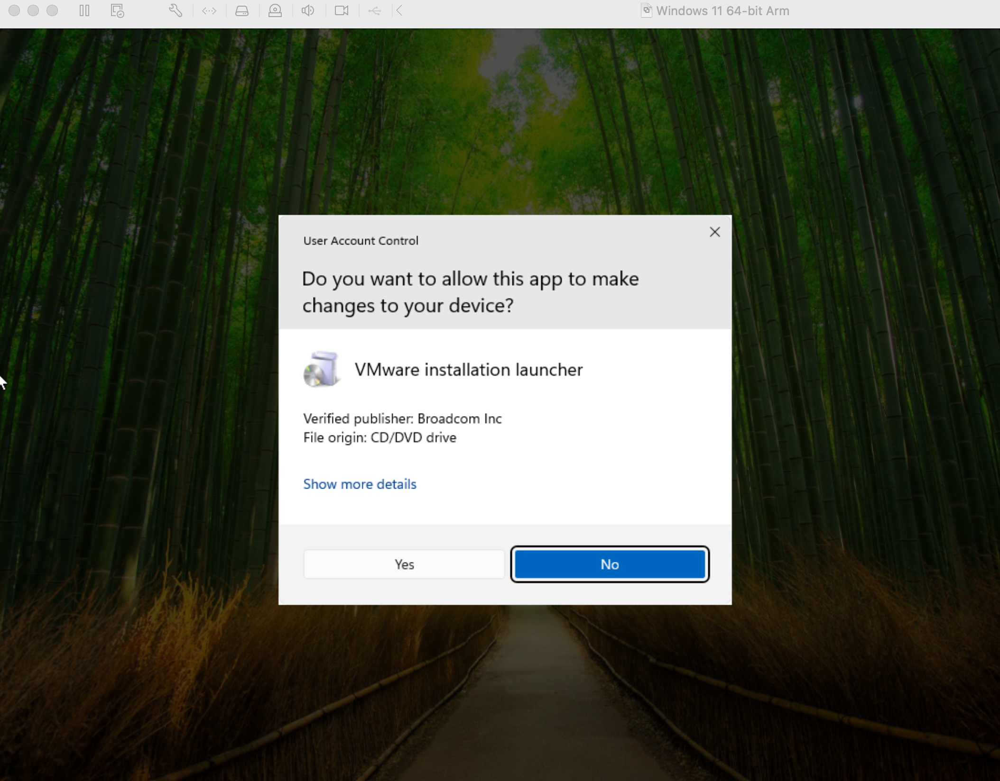

# VMware-Windows11-Setup

A comprehensive project documenting the setup and configuration of a Windows 11 ARM virtual machine using VMware Fusion.

## Overview

This project provides a step-by-step guide to setting up and configuring a Windows 11 ARM virtual machine on macOS using VMware Fusion. Whether you're a beginner or experienced with virtual machines, this guide will walk you through the entire process.

---

## Why Use Virtualization?

Virtualization allows you to run multiple operating systems on a single physical machine, offering several benefits:

- **Efficient Resource Utilization**: Run multiple operating systems or applications on one device without dual-booting.
- **Safe Testing Environments**: Test software or configurations without affecting your main system.
- **Flexibility**: Easily switch between different operating systems without rebooting.

---

## Key Steps Covered

1. Downloading and installing VMware Fusion.
2. Acquiring a Windows 11 ARM ISO image.
3. Creating a new virtual machine in VMware Fusion.
4. Configuring the virtual machine for optimal performance.
5. Troubleshooting common issues during setup.

---

## Files Included in This Repository

- **README.md**: The guide you're reading now.
- **Screenshots**: A folder containing helpful screenshots of the setup process.
- Any additional configuration or code files required for the setup.

---

## Screenshots
Here are some examples of what to expect during the setup process:

  
*Choosing firmware type UEFI Secure Boot*

  
*Complete VM configuration summary (Guest OS, Disk Capacity, etc.)*

  
*Select the location to install Windows 11*

  
*Installing Windows 11 (15% progress)*

  
*Security account setup completed (Successful)*

  
*VMware installation launcher prompt (Allow to make changes)*

  
*VMware Tools installation wizard (Welcome screen)*

  
*VMware Tools setup (Custom or Typical installation)*

  
*Installing VMware Tools (Loading USB mouse driver)*

---

### Next Steps
1. Verify that all your images are in the `Screenshots` folder.
2. Commit the changes on GitHub.

## About This Project
This is my first project, and I'm really excited to share it with you! I'm still learning, so I would really appreciate any guidance or feedback. If you'd like to collaborate or have suggestions, feel free to reach out or fork the repository. Thanks for your support!
